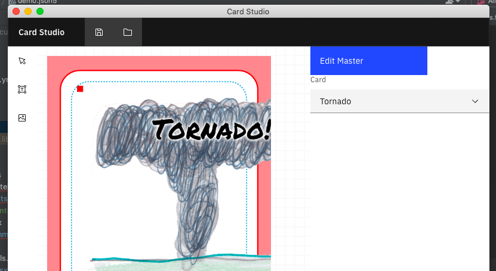

I was helping my son create a new board game and was looking for an easy way to generate cards using CSV data.  This is a small desktop (electron) app that kind of works.

[Repo](https://github.com/Kikketer/CardStudio)

## Card Studio Idea

There are many days where my son will attempt to build a board game. I love this since I've attempted this same thing many many times without much success (see [Skylight Game](./skylight-game) and [Catapults Game](./catapults-game)).  He proposed this pretty fantastic and simple game based on his love for [Wings of Fire](https://www.goodreads.com/series/92037-wings-of-fire).

During the creation of the game I wanted to have a way to quickly generate the playing cards.  I know that [The Game Crafter](https://www.thegamecrafter.com) created an application called [Component Studio](https://component.studio/) which serves the purpose of building game components. This product has a monthly fee and since I change projects nearly daily, it didn't make much sense financially.

But I'm cheap and I like to build things. I decided to attempt to build a desktop version of the application with the intent that this is free, easy and gets the job done well enough.

## The Goals

The goals were simple:
- Allow the user to build a "master" template of the cards
- Read a CSV document to generate the cards
- Allow the use of a drag/drop style interaction to design the cards
- Run entirely on the desktop, allowing a user to have a project that could be easily shared (think Github)

### The User Flow

A user would open a "project" file, likely a JSON5 document (I love JSON5). This project file would have all the needed meta-data like project title and the like but also the definitions and descriptions for each "deck".

The user then would be able to edit the "master" file of a deck which is sort of like a template for the entire deck. Using a specially crafted variable input they would be able to use the values that existed in the CSV document.

Lastly the user would be able to click the "generate" button and would get a series of images that are "Game Crafter ready" that they could use to upload or print.

## The Tools

Through building this application I used the following tools:
- [Electron](https://www.electronjs.org/): The foundation to make your web application be a desktop application. This technique isn't new and is used by many applications today.
- [Konva](https://konvajs.org/): A great canvas library that allows you to draw on an HTML canvas.

## The "Conclusion"

I've since moved away from this project since new things have landed on my plate.  The game did make it all the way to [The Game Crafter](https://www.thegamecrafter.com/games/dragon-world) but didn't use Card Studio directly.

I did however generate the cards used in the game using the same tools, I just didn't use the IDE that I was intending to build.

Lastly this project is a bit paused right now mostly because I've not updated my OS on my MacBook Air and it seems the SASS dependencies no longer compile for the project.

## The Learnings

I had a couple ah-ha moments when I realized that I could use a standard mindset of a network API to generate the cards without having to view the page each time.

Previous adventures in this type of thing required me to render the entire card on a visible HTML page to export it as a .png file. This involved an annoying process of having to click each card and then click a "download" button.

The solution was to have the cards render on the "client" (renderer) but hidden and their base64 encoded result would be sent to the "backend" (main) of Electron. From there the file can be saved directly to the file system.

## The Future

I do plan to continue working on this fun project but I always need more inspiration. My kids are the source of all my inspiration and I'll likely come back to this project once my son decides to build yet another game.

