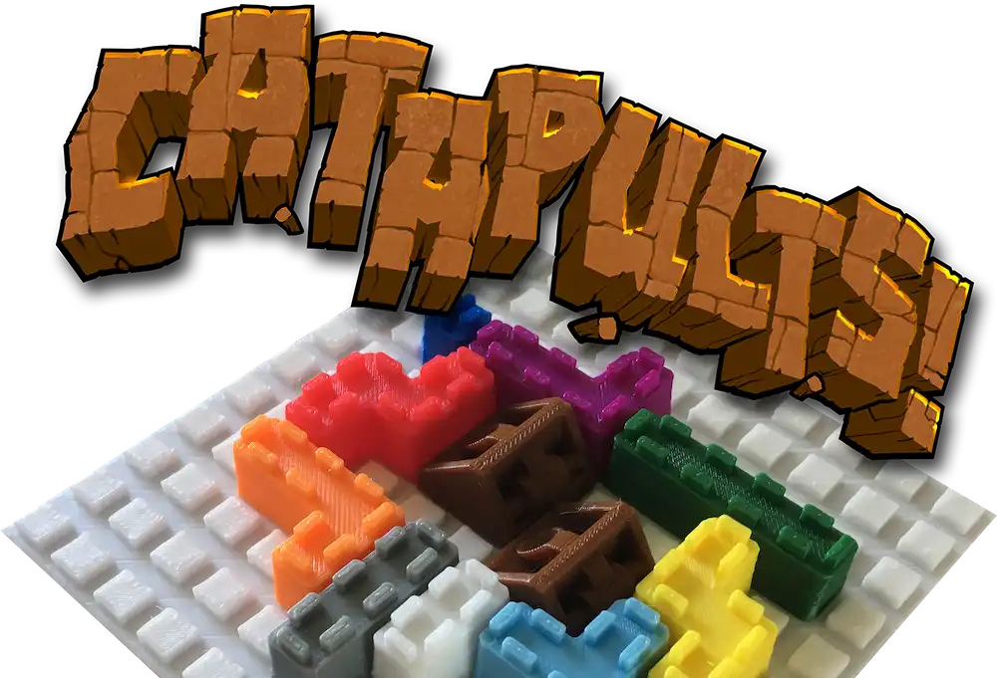
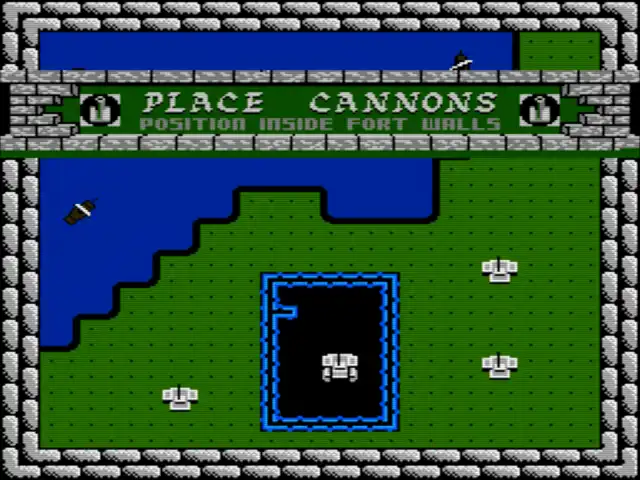
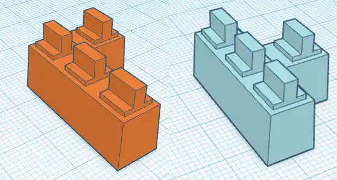

Using the power of my 3D printers, I wanted to create a board game. Inspired by the NES game "[Rampart](https://en.wikipedia.org/wiki/Rampart_(video_game))" I created a fun little game that can mostly be created by anyone with a 3D printer.

## The Inspiration
Inspired by an old NES game I wanted to use my newly [purchased 3D printer](https://www.prusa3d.com/category/original-prusa-i3-mk3s/) and combine it with one of my passions: board game design.

The original game was similar to Tetris where you'd received random shaped pieces and use them to build a complete castle.

Once your castle was complete you'd be gain a number of cannons and had to find places for them within the castle walls.

Both characters would then start launching cannon balls at the opposing players castle, attempting to wreck their castle for the next round of building.

Players would play about three rounds and the player with the most cannons at the end was the winner.

## Adapting to Physical Components
Creating a board game has many aspects that must be considered, a few of which are size, complexity and price.

In a (typical) board game you do not have any automated processes or artificial intelligence, everything must be done by a human player.  In video games you'd be able to use the computer to calculate complicated scores, perform large if/then blocks of rules.  Every bit of "overhead" that a human must do in a board game is something that detracts from the fun.

First challenge I wanted to solve was the hectic feel of getting the random pieces.

"Hectic" is an easy solve by having a timer.  Players hate being rushed into decisions and this matched the original game since it had a timer around placing pieces of your castle. A simple sand timer was the solution.

For the random pieces aspect I used a deck of cards. Cards are the cheapest part of any board game and are incredibly versatile. Each player would get a small deck of cards to draw from in the "build" phase using the timer.

The second challenge was how to benefit the players for building a complete castle with these cards and pieces (see designing pieces next). I didn't want this game to be a "dexterity game" where you are physically throwing pieces around to see if they hit, that always ends up feeling cheep and is a mess.

A simple solution was to re-use the deck of cards that you played to build your castle as a number system for the sizes of pieces you could remove. This left the player with bit of choice but restricted them based on how many pieces they were able to place within the build phase.

Ok that was pretty easy, the two biggest challenges were out of the way... mostly.  I still wanted to use the 3D printer and having it create the castle wall pieces made the most sense.

## Designing the Components
For designing the 3D printed components I exclusively used [Tinkercad](https://www.tinkercad.com/).  It's incredibly easy to build simple shapes and it fit my "just get it done" attitude.

By trial and error I was able to get a piece that not only printed without supports by using arches but allowed for enough gap to be placed quickly on a board.

The board! Yes there needed to be a board, similar to a lego where the pieces would click into place but would be easier to place than an official LEGO style piece.

I came up with a reasonable sized board that was a grid of raised squares. The pieces were Tetris shaped pieces with little "grab" handles on the top that kind of almost looked like a [battlement](https://en.wikipedia.org/wiki/Battlement).

I then made sure that each piece shape was a different color to allow grabbing of the pieces to be quick. We all know what it's like getting the "L" or "J" piece mixed up when playing Tetris.

## Printing
I used [The Game Crafter](https://www.thegamecrafter.com) to print the box, cards, rules and provide the timer.  The plan was to get these boxes printed then fill them with the 3D printed walls.

I ordered a pile of colored filament and started printing away. I even ordered a backup printer as I was afraid the first was going to fail, the side effect was that I was able to double production.

In the end I printed about 15 sets of pieces and bagged them all ready for their boxes.

## Proposing to Publishers
I was able to propose this game to publishers during a "speed dating" style event at GenCon.  I was chosen after submitting my one-page rundown of the game and since I was heading down there to play games, it was perfect timing.

Almost every publisher that saw the game loved it and was able to play a round during the 2 or 3 minutes that we had to talk.

However everyone quickly realized the cost of creating Catapults. Each piece required a different mold since they each needed to be their own color. The publishers that saw the game didn't have the means to take this high of a risk.

I even talked to a printing company to see what it would take and they agreed the price was high for the perceived value of the game.

In the end none of the publishers were ready to take my game.

## The Results
This game is sitting in my basement, waiting to be played.  I have several copies printed out and in baggies.  I've since taken the official website down and this game shows up randomly at [conventions](https://www.gameholecon.com/) where I host when there's not a global pandemic.
