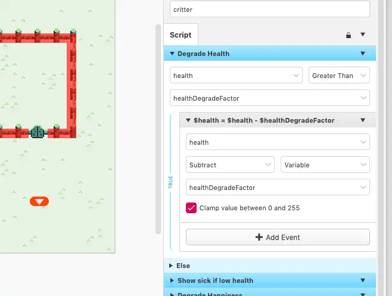
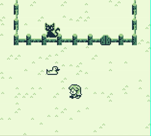
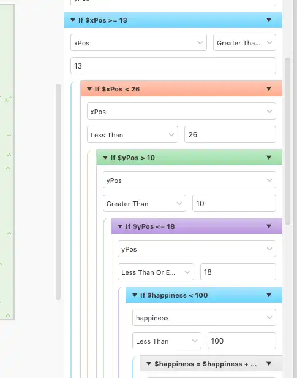
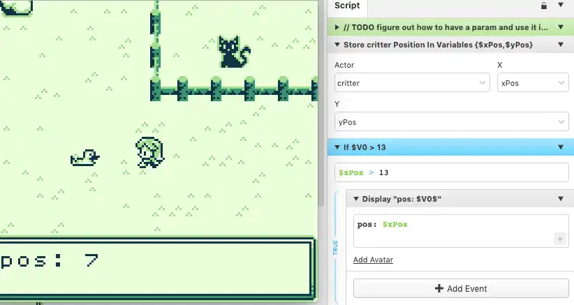

Moving from [GDevelop](https://gdevelop-app.com/) to [GB Studio](https://www.gbstudio.dev/) to and really gaining traction on the game development.

## Moving to GBStudio

In my previous post about the game development of [Pokemon Rescue](/posts/pokemon-rescue/) I explained how I decided on using GDevelop to quickly create a game for my daughter.  The idea was to keep it simple and force myself into a limited environment.

In today's realm of web and mobile technology, there's really no limit to what you can do. That can be entirely overwhelming for anyone learning something new, I've tried several times to build a video game using things like [PhaserJS](https://phaserjs.com/). However whenever I start a project like this I always get hung up for hours on the development environment, graphics and "what limits should I put on myself".

[GDevelop](https://gdevelop-app.com/) opened my eyes to the "drag and drop IDEs" that have been built to create games. And my experience in GDevelop has been amazing. I was able to quickly create a small video game and focus on the fun stuff instead of useless little details that make me twitch like code formatting.

Then I discovered [GBStudio](https://www.gbstudio.dev/) that was geared for building games for GameBoy. This satisfied nearly the exact requirements I set for myself: simple, limited and playable on dedicated hardware. With that I decided to give GBStudio a real chance.

## Some Clear Progress

Within a few days (these are parent/adult days, where I only get to spare a few hours) I was able to get a game built out that mirrored the same functionality that I had in GDevelop!

As I was building and adapting the game, I had to take into account a few more limitations that I think actually improved the game. This reminds me of the other things I'm studying around web accessibility: making a website accessible tends to make the site even better than you first imagined.

I started by making sure I could do the more difficult requirement: "carry a creature from one space to another". Unlike what I built in GDevelop, I wasn't able to simply take a sprite and move it with the character. I had to create a "carrying" sprite for the player and show/hide the creature being carried. This actually turned out quite well and is exciting to see how it works.

With this new "carrying" technique figured out I changed my initial plan to be more of a "pick up and carry" game vs a menu-driven game for each creature. This type of "just carry creatures around" aspect the game actually became much more fun. I'm still working out all the details but here are a few initial screens:

## Development Experience in GBStudio

GBStudio a bit more buggy than GDevelop as there are several times when I attempt to use one of their more advanced features and it doesn't work as expected. There's not much feedback for the developer either as I've not yet found a "run in debug mode" type of thing. I've actually had to use in-game dialogs to debug what variables are set to.

The drag and drop nature of the IDE can feel a bit cumbersome at times as well especially when you are already a developer. A bug I've filed recently really makes my head hurt because of my ingrained knowledge of if checks.

<h2 id="abandoned">Abandoned</h2>

Updated Jan 1st 2022: I've walked away from GBStudio for now since there were some critical things that I was not able to do. The two major issues were:

1. Performance issues around movement
2. Update for each critter paused when off screen

For the "performance issues around movement", I had the critters move one space at a time using a random number (1-4 one for each direction). The problem wasn't so much that the random number was slowing things down, it was the actual movement. I found that while a critter was moving the entire game slowed dramatically. My goal was to have 10 critters at a time, but the game was unplayable at 4.

<video controls title="Framerate drops" aria-label="The player character moving around a farm and framerate of the game drops dramatically as the animals move">
  <source src="/images/pokemon-gb-move-performance.webm">
  Sorry your browser doesn't support this video
</video>

The "update offscreen" issue comes from an inherent GB performance necessity to keep the game running smoothly. The onUpdate logic was great, each critter had it's own bit of code to run to add or subtract it's health and happiness on a timer. Simply walking far enough away from a critter would allow it to live and be happy forever. I want the constant "oh better go check on X critter" feeling in my game.

A suggested solution was to make a single actor, always visible that maintained all of the other critters. But the way GBStudio is built you can not access "internal" variables for an actor from a separate actor. This means I would have to have all the health and happiness of each actor tracked in individual global variables.

All of these limitations are fantastic to have when attempting to build something. I loved that GBStudio forced me to re-evaluate the actual game itself and made the game simpler and more fun at the same time. The GDevelop version had a whole menu system to pet, pick up and feed the critters which now feels very clunky and annoying. GBStudio forced me to make it a simple "pick up a critter and place it where it needs to be" game.

I've updated GDevelop version to remove the menu but now I'm going to try and build this game using [MakeCode Arcade](https://arcade.makecode.com/) because it has the ability to use dedicated [external hardware](https://www.amazon.com/Kittenbot-Card-Sized-Computer-Microsoft-Compatible/dp/B07XSWXPZL/ref=sr_1_1_sspa) very similar to the GameBoy. I'll be posting my adventure with that platform next.
